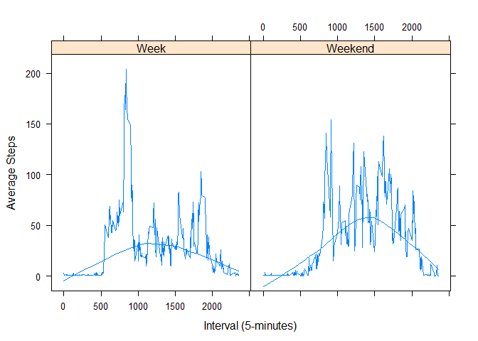

# Reproducible Research: Peer Assessment 1


## Loading and preprocessing the data

```r
library(dplyr)
```

```
## 
## Attaching package: 'dplyr'
## 
## The following objects are masked from 'package:stats':
## 
##     filter, lag
## 
## The following objects are masked from 'package:base':
## 
##     intersect, setdiff, setequal, union
```

```r
unzip("activity.zip")
activity <- read.csv("activity.csv")

# Convert date from factor to date format
activity$date <- as.Date(activity$date)
```


## What is mean total number of steps taken per day?

```r
# Group by day
steps.day <- activity %>% 
        group_by(date) %>% 
        summarise(DailySteps = sum(steps))

hist(steps.day$DailySteps, 
             col = "blue", 
             xlab = "Steps", 
             ylab = "Frequency", 
             main = "Steps per Day")

steps.day.mean <- mean(steps.day$DailySteps, na.rm = TRUE)
steps.day.median <- median(steps.day$DailySteps, na.rm = TRUE)
abline(v=steps.day.mean, col = "red", lwd = 2, lty = 1 )
abline(v=steps.day.median, col = "green", lwd = 2, lty = 2 )
```

 

*  The mean total number of steps per day is 10,766.2 steps, indicated as red line on the histogram.

*  The median total number of steps per day is 10,765 steps, indicated by the green line on the histogram.

## What is the average daily activity pattern?

```r
steps.interval <- activity %>% 
        group_by(interval) %>% 
        summarise(AvgSteps = as.integer(ceiling(mean(steps, na.rm = TRUE))))

with(steps.interval, plot(x = interval, 
                          y= AvgSteps, 
                          type= "l", 
                          xlab= "Daily 5 minute intervals", 
                          ylab="Steps"))

# maximum number of steps
Interval.max.steps <- steps.interval$interval[which.max(steps.interval$AvgSteps)]
abline(v = Interval.max.steps,col = "red", lwd = 2, lty = 2 )
```

 

The most steps was taken during interval 835, as indicated by the red dotted line in the trend.

## Imputing missing values

There are 2304 missing values, which is a small proportion (4.4%) of the data.  The missing data would be filled with the average value of the 5-minute interval.


```r
# Create a new dataset
        activity.impute <- activity

# combine the datasets by interval and then update the columns
        activity.impute <- merge(x = activity, 
                                 y = steps.interval, 
                                 all.x = TRUE)

        activity.impute$steps[is.na(activity.impute$steps)] <- activity.impute$AvgSteps
```

```
## Warning in activity.impute$steps[is.na(activity.impute$steps)] <-
## activity.impute$AvgSteps: number of items to replace is not a multiple of
## replacement length
```

```r
        steps.day.impute <- activity.impute %>% 
                group_by(date) %>% 
                summarise(DailySteps = sum(steps))
# Histogram       
        hist(steps.day.impute$DailySteps, 
                     col = "blue", 
                     xlab = "Steps", 
                     ylab = "Frequency", 
                     main = "Steps per Day (Imputed)")

steps.day.impute.mean <- mean(steps.day.impute$DailySteps, na.rm = TRUE)
steps.day.impute.median <- median(steps.day.impute$DailySteps, na.rm = TRUE)
abline(v=steps.day.impute.mean, col = "red", lwd = 2, lty = 1 )
abline(v=steps.day.impute.median, col = "green", lwd = 2, lty = 2 )
```

 

After imputing the missing values with the average of each of the 5-minute intervals, the following changes are observed:

*  The mean total number of steps per day reduced from 10,766.2 steps to 9,388.23 steps, as indicated by red line on the histogram.

*  The median total number of steps per day reduced from 10,765 steps to 10,395 steps, indicated by the green line on the histogram.

The overall effect is visible in the lower values of the histogram's distribution.

## Are there differences in activity patterns between weekdays and weekends?


```r
# Add column to show type of day week/weekend
        Weekend <- c("Saturday", "Sunday")

activity.impute <- mutate(activity.impute, 
                           DayType = as.factor(
                                   ifelse(weekdays(activity.impute$date) 
                                          %in% Weekend,"Weekend", "Week")))
# Summary
steps.interval.impute <- activity.impute %>% 
        group_by(interval, DayType) %>% 
        summarise(AvgSteps = as.integer(ceiling(mean(steps, na.rm = TRUE))))
# Plot
library(lattice)
xyplot(steps.interval.impute$AvgSteps ~ steps.interval.impute$interval |
        steps.interval.impute$DayType,
        type = c("l", "smooth"),
        xlab = "Interval (5-minutes)", 
        ylab = "Average Steps")
```

 

Looks like an desk jockey that gets around on weekends.

